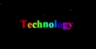

# Frontend Animation Showcase 🎨🎭🚀

A collection of fantastic frontend animations using Anime.js. Dive in to explore 🌌!

## Table of Contents 📚

1. [Introduction](#introduction-)
2. [Setup](#setup-⚙️)
3. [How to Use](#how-to-use-🛠)
4. [Tech Stack](#tech-stack-💻)
5. [Projects](#projects-📂)
    - [Fireworks](#fireworks-🎆)
    - [Rolling Numbers](#rolling-numbers-🔢)
    - [Running Dots](#running-dots-⚫)
    - [Text Glow Shake](#text-glow-shake-✨)
6. [License](#license-📝)

## Introduction 🌟

This repository is a showcase of frontend animations created using Anime.js. Each project is an artistic piece of code that brings frontend animations to life. Perfect for learning, inspiration, or just for fun!

## Setup ⚙️

1. Clone this repository.
    ```
    git clone https://github.com/yourusername/Frontend-Animation-Showcase.git
    ```
2. Navigate to each project folder.
3. Open the `index.html` in your favorite browser.

## How to Use 🛠

Each project is standalone. To run any project, simply open its `index.html` file in a web browser.

## Tech Stack 💻

- HTML5
- CSS3
- JavaScript
- Anime.js

## Projects 📂

### Fireworks 🎆


A mesmerizing fireworks animation to light up your web projects. [See Code](./Fireworks)

### Rolling Numbers 🔢


A captivating animation that rolls through numbers in a stylish way. [See Code](./RollingNumbers)

### Running Dots ⚫
A particle animation that brings the concept of running dots to life. [See Code](./Running-Dots)

### Text Glow Shake ✨


A text animation that combines glowing and shaking effects for an interactive experience. [See Code](./Text-Glow-Shake)

## License 📝

This project is licensed under the MIT License. See the [LICENSE](./LICENSE) file for details.
